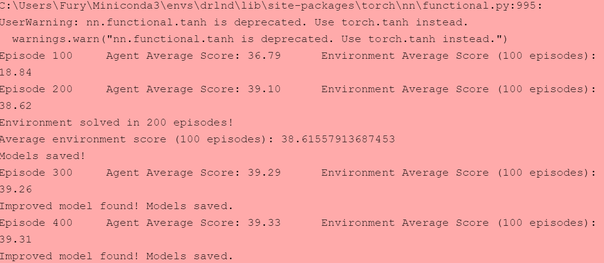

# Learning Algorithm

### Algorithm Used

The provided algorithm, deep neural network model, and check pointed weights were created from
an adaptation of DDPG used in the OpenAI Gym's Pendulum environment. See below for original details and algorithm overview.

[DDPG-Original-Pendulum](https://github.com/udacity/deep-reinforcement-learning/tree/master/ddpg-pendulum)

[DDPG Algorithm Overview](https://spinningup.openai.com/en/latest/algorithms/ddpg.html)

---

### Deep Neural Network Models

#### Actor Architecture

|Layer|Value|
|:-----:|:---:|
|Input w/ Normalization|environment state (vector length 33)|
|Linear Layer|33 x 500|
|Relu|Activation|
|Linear|500 x 200|
|Relu|Activation|
|Linear|200 x 4|
|Output w/ tanh activation|action space (vector length 4)|

Output:

A *tanh* activation was used to keep values within environment action space of -1 to 1.
Output of this network is the best believed action for any given state, even for continuous action spaces like reacher. This is a deterministic policy.

#### Critic Architecture

|Input w/ Normalization|environment state (vector length 33)|
|:-----:|:---:|
|Linear Layer|33 x 500|
|Relu|Activation|
|Concatenate|500 + action space(vector length 4), 200|
|Linear|504 x 200|
|Relu|Activation|
|Linear|200 x 1|
|Ouput|1|

Output:

*No* activation was used on the output of this layer.

*Note the concatenation was performed based on the original paper linked above to add the action
taken to the state space as input to the 2nd layer for the critic network.
Output of this network is used to compute the loss for backpropagation. The key take away is that the critic network takes into account the state space *as well as the action taken in that state space* to produce an expected return (Q value) that can be used as a target to train against.

#### Model Parameters

The following parameters were used for training:


```
BUFFER_SIZE = int(1e7)  # replay buffer size
BATCH_SIZE = 512        # minibatch size
GAMMA = 0.99            # discount factor
TAU = 1e-3              # for soft update of target parameters
LR_ACTOR = 1e-3         # learning rate of the actor
LR_CRITIC = 1e-3        # learning rate of the critic
WEIGHT_DECAY = 0        # L2 weight decay
UPDATE_EVERY = 2        # update frequency from timesteps
n_episodes = 400        # number of episodes for training
max_t = 1000            # max timesteps per episode
add_noise = False       # add noise to model actions
```

---

#### Training Results

As shown the following plot demonstrates that the environment was solved in 200 episodes based on an average score taken over 20 agent over 100 episodes (Score of > 30.0). In addition, the plot demonstrates that training scores peaked around 150 episodes and remained stable all the way through the max number of specified episodes to train for. After 150 episodes there was only marginal gain because there was little more to be had as the agents were already maximizing environment scores. This was confirmed when running inference in the last cell of the `Continuous_Control.ipynb` notebook.

Training progress per episode:




---

#### Ideas For Future Work

- I think it would be interesting to incorporate some noise into training to see how stable the model remains. This solution was adapted from a previous environment and I was not sure how the previous environment's noise values would affect this environment's actions. As a result of the difficulty involved in Deep RL, I decided to not include it for this environment until more realistic noise values could be simulated. Specifically noise values that reflect real world variance for robotic arms.

- I would like to try to tackle the crawler environment using DDPG to see how it would fair in a far more continuous action space.

- I would like to try to solve this environment using other Deep RL algorithms fit for continuous action spaces.